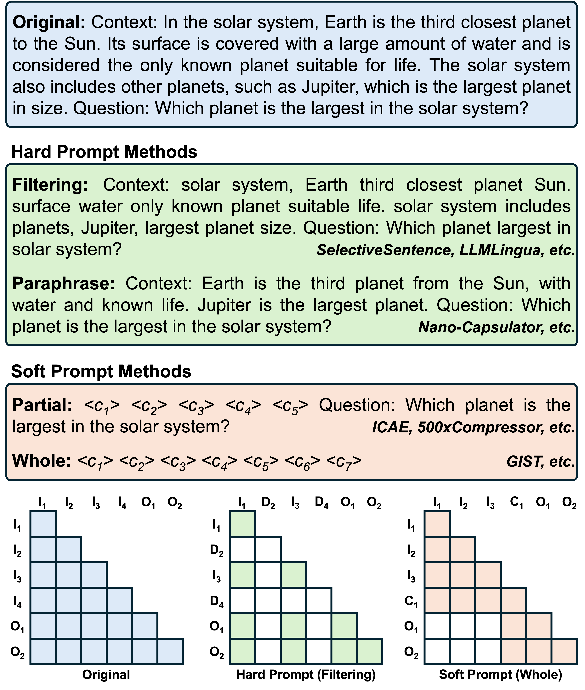
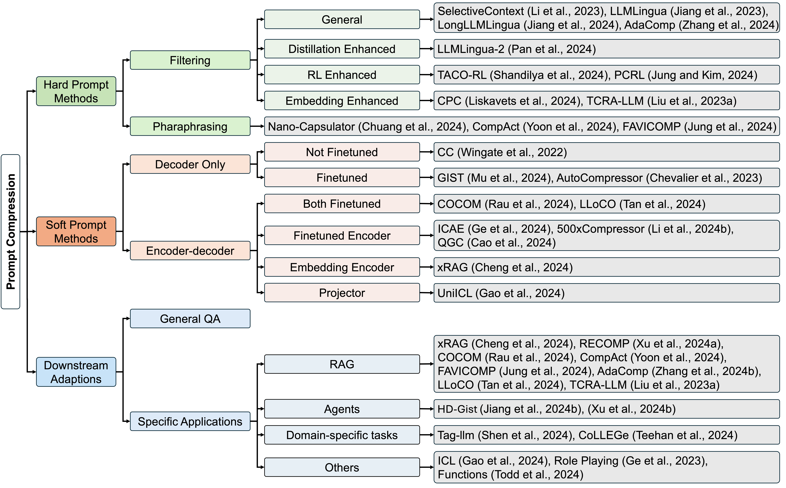
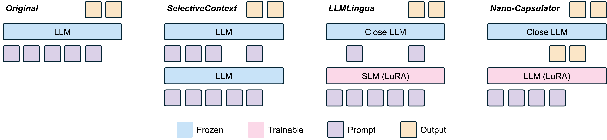
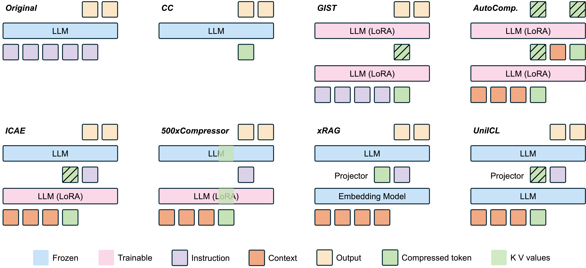

# [NAACL 2025 Main Selected Oral] Prompt Compression for Large Language Models: A Survey

<p align="center">
  <b>Content</b>
</p>

<p align="center">
  <a href="#news">🚀 News</a> •
  <a href="#todo">✏️ Todo</a> •
  <a href="#introduction">✨ Introduction</a>
</p>

<p align="center">
  <a href="#examples">👀 Examples</a> •
  <a href="#tree overview">🌳 Tree Overview</a> •
  <a href="#paper list">📖 Paper List</a> •
  <a href="#visualisations">🎨 Visualisations</a>
</p>

<p align="center">
  <a href="#citation">📌 Citation</a> •
  <a href="#license">🔖 License</a>
</p>
<div id="news">&nbsp;</div>

<p align="center">
  <b>Links</b>
</p>

<p align="center">
  <a href="">Project Page</a> •
  <a href="https://aclanthology.org/2025.naacl-long.368/">Paper</a>
</p>


## 🚀 News

- **[2025.01.22]** This paper was accepted by NAACL 2025 Main!
- **[2024.10.16]** The paper was uploaded to Arxiv.

<div>&nbsp;</div>
<div>&nbsp;</div>
<div id="todo">&nbsp;</div>


## ✏️ Todo

- [ ] Release the full README page.

<div>&nbsp;</div>
<div>&nbsp;</div>
<div id="introduction">&nbsp;</div>


## ✨ Introduction

A survey on prompt compression methods with insights and visualisations.

### Contributions:
- **Methods Overview:** An overview of prompt compression methods, categorized into hard prompt methods and soft prompt methods.  
- **Insights:** Various ways to understand method mechanisms. 
- **Visualisations:** Illustrations for various prompt compression methods. 

<div>&nbsp;</div>
<div>&nbsp;</div>
<div id="examples">&nbsp;</div>


## 👀 Examples

<p align="left">
  
</p>

Illustrative examples of prompt compression methods. Hard prompt methods remove low-information tokens or paraphrase for conciseness. Soft prompt methods compress text into a smaller number of special tokens, $<c_n>$. The grids below visualize attention patterns, where the y-axis represents the sequence of tokens, and the x-axis shows the tokens they attend to. (Bottom left) Original prompt: Each token attends to all previous tokens. (Bottom middle) Hard prompt (filtering): Each token cannot attend to previous deleted tokens ($D_i$). (Bottom right) Soft prompt (whole): After the compression token ($C_i$) attends to all prior input tokens ($I_i$), subsequent output tokens ($O_i$) cannot attend to tokens before the compression token.

<div>&nbsp;</div>
<div>&nbsp;</div>
<div id="tree overview">&nbsp;</div>

## 🌳 Tree Overview

<p align="left">
  
</p>

Hierarchical overview of prompt compression methods and their downstream adaptions. For downstream adaptations, compression methods not belonging to specific categories can be classified into general QA.

<div>&nbsp;</div>
<div>&nbsp;</div>
<div id="paper list">&nbsp;</div>


## 📖 Paper List

### Hard Prompt Methods:

- **Filtering:**

  - General: 

    - [[SelectiveContext](https://aclanthology.org/2023.emnlp-main.391/)] Compressing Context to Enhance Inference Efficiency of Large Language Models
    - [[LLMLingua](https://aclanthology.org/2023.emnlp-main.825/)] Compressing Prompts for Accelerated Inference of Large Language Models
    - [[LongLLMLingua](https://aclanthology.org/2024.acl-long.91/)] Accelerating and Enhancing LLMs in Long Context Scenarios via Prompt Compression
    - [[AdaComp](https://arxiv.org/abs/2409.01579)] Extractive Context Compression with Adaptive Predictor for Retrieval-Augmented Large Language Models

  - Distillation Enhanced:

    - [[LLMLingua-2](https://aclanthology.org/2024.findings-acl.57/)] Data Distillation for Efficient and Faithful Task-Agnostic Prompt Compression

  - RL Enhanced: 

    - [[TACO-RL](https://arxiv.org/abs/2409.13035)] Task Aware Prompt Compression Optimization with Reinforcement Learning
    - [[PCRL](https://openreview.net/forum?id=yewD_qbYifc)] Priority Convention Reinforcement Learning for Microscopically Sequencable Multi-agent Problems

  - Embedding Enhanced:

    - [[CPC](https://arxiv.org/abs/2409.01227)] Prompt Compression with Context-Aware Sentence Encoding for Fast and Improved LLM Inference
    - [[TCRA-LLM](https://aclanthology.org/2023.findings-emnlp.655/)] Token Compression Retrieval Augmented Large Language Model for Inference Cost Reduction

- **Paraphrasing:**

  - (No sub category)
  
    - [[Nano-Capsulator](https://aclanthology.org/2024.naacl-long.429/)] Learning to Compress Prompt in Natural Language Formats
    - [[CompAct](https://aclanthology.org/2024.emnlp-main.1194/)] Compressing Retrieved Documents Actively for Question Answering
    - [[FAVICOMP](https://arxiv.org/abs/2409.12468)] Familiarity-Aware Evidence Compression for Retrieval-Augmented Generation

### Soft Prompt Methods:

- **Decoder Only:**

  - Not Finetuned:

    - [[CC](https://aclanthology.org/2022.findings-emnlp.412/)] Prompt Compression and Contrastive Conditioning for Controllability and Toxicity Reduction in Language Models

  - Finetuned:

    - [[GIST](https://openreview.net/forum?id=2DtxPCL3T5)] Learning to Compress Prompts with Gist Tokens
    - [[AutoCompressor](https://aclanthology.org/2023.emnlp-main.232/)] Adapting Language Models to Compress Contexts

- **Encoder-decoder:**

  - Both Finetuned:

    - [[COCOM](https://arxiv.org/abs/2407.09252)] Context Embeddings for Efficient Answer Generation in RAG
    - [[LLoCO](https://aclanthology.org/2024.emnlp-main.975/)] Learning Long Contexts Offline

  - Finetuned Encoder:

    - [[ICAE](https://openreview.net/forum?id=uREj4ZuGJE)] In-context Autoencoder for Context Compression in a Large Language Model
    - [[500xCompressor](https://arxiv.org/abs/2408.03094)] Generalized Prompt Compression for Large Language Models
    - [[QGC](https://aclanthology.org/2024.acl-long.685/)] Retaining Key Information under High Compression Ratios: Query-Guided Compressor for LLMs

  - Embedding Encoder:

    - [[xRAG](https://openreview.net/forum?id=6pTlXqrO0p&referrer=%5Bthe%20profile%20of%20Furu%20Wei%5D(%2Fprofile%3Fid%3D~Furu_Wei1))] Extreme Context Compression for Retrieval-augmented Generation with One Token

  - Projector:

    - [[UniICL](https://arxiv.org/abs/2405.17062)] Unifying Demonstration Selection and Compression for In-Context Learning

### Applications:

- **RAG:**

  - (No sub category)

    - [[xRAG](https://openreview.net/forum?id=6pTlXqrO0p&referrer=%5Bthe%20profile%20of%20Furu%20Wei%5D(%2Fprofile%3Fid%3D~Furu_Wei1))] Extreme Context Compression for Retrieval-augmented Generation with One Token
    - [[RECOMP](https://openreview.net/forum?id=mlJLVigNHp)] Improving Retrieval-Augmented LMs with Context Compression and Selective Augmentation
    - [[COCOM](https://arxiv.org/abs/2407.09252)] Context Embeddings for Efficient Answer Generation in RAG
    - [[CompAct](https://aclanthology.org/2024.emnlp-main.1194/)] Compressing Retrieved Documents Actively for Question Answering
    - [[FAVICOMP](https://arxiv.org/abs/2409.12468)] Familiarity-Aware Evidence Compression for Retrieval-Augmented Generation
    - [[AdaComp](https://arxiv.org/abs/2409.01579)] Extractive Context Compression with Adaptive Predictor for Retrieval-Augmented Large Language Models
    - [[LLoCO](https://aclanthology.org/2024.emnlp-main.975/)] Learning Long Contexts Offline
    - [[TCRA-LLM](https://aclanthology.org/2023.findings-emnlp.655/)] Token Compression Retrieval Augmented Large Language Model for Inference Cost Reduction

- **Agents:**

  - (No sub category)

    - [[HD-Gist](https://aclanthology.org/2024.findings-eacl.143/)] Hierarchical and Dynamic Prompt Compression for Efficient Zero-shot API Usage
    - [[Link](https://arxiv.org/abs/2407.02043)] Concise and Precise Context Compression for Tool-Using Language Models

- **Domain-specific tasks:**

  - (No sub category)

    - [[Tag-llm](https://openreview.net/forum?id=LlqphyBdeT&referrer=%5Bthe%20profile%20of%20David%20Alvarez-Melis%5D(%2Fprofile%3Fid%3D~David_Alvarez-Melis1))] Repurposing General-Purpose LLMs for Specialized Domains
    - [[CoLLEGe](https://openreview.net/forum?id=Fkr1yVUb9G#discussion)] Concept Embedding Generation for Large Language Models

- **Others:**

  - (No sub category)

    - [[ICL](https://arxiv.org/abs/2405.17062)] Unifying Demonstration Selection and Compression for In-Context Learning
    - [[Role Playing](https://openreview.net/forum?id=lRxpVfDMzz&noteId=FCpjbTksSl)] Extensible Prompts for Language Models on Zero-shot Language Style Customization
    - [[Functions](https://openreview.net/forum?id=AwyxtyMwaG&noteId=KCsskXIh9z)] Function Vectors in Large Language Models

<div>&nbsp;</div>
<div>&nbsp;</div>
<div id="visualisations">&nbsp;</div>


## 🎨 Visualisations

<p align="left">
  
</p>

Architectures for various prompt compression models by hard prompt methods. For SelectiveContext and LLMLingua, the bottom language models filter the prompt tokens without modifying them, serving as selection mechanisms. In Nano-Capsulator, the bottom LLM generates a paraphrased version of the input prompt which then serves as input for the LLM above. "SLM" means "small language model". "Close LLM" refers to closed-source language models that only accept natural language inputs through API calls.

<div>&nbsp;</div>

<p align="left">
  
</p>

Architectures for various prompt compression models by soft prompt methods. Tokens with diagonal stripes represent the output tokens processed by the language models. Different from hard prompt methods, the bottom LLMs in soft prompt methods process the input tokens, and their outputs (tokens with diagonal stripes) serve as input for the LLMs above.

<div>&nbsp;</div>
<div>&nbsp;</div>
<div id="citation">&nbsp;</div>


## 📌 Citation

```
@inproceedings{li-etal-2025-prompt,
    title = "Prompt Compression for Large Language Models: A Survey",
    author = "Li, Zongqian  and
      Liu, Yinhong  and
      Su, Yixuan  and
      Collier, Nigel",
    editor = "Chiruzzo, Luis  and
      Ritter, Alan  and
      Wang, Lu",
    booktitle = "Proceedings of the 2025 Conference of the Nations of the Americas Chapter of the Association for Computational Linguistics: Human Language Technologies (Volume 1: Long Papers)",
    month = apr,
    year = "2025",
    address = "Albuquerque, New Mexico",
    publisher = "Association for Computational Linguistics",
    url = "https://aclanthology.org/2025.naacl-long.368/",
    pages = "7182--7195",
    ISBN = "979-8-89176-189-6",
}
```

<div>&nbsp;</div>
<div>&nbsp;</div>
<div id="license">&nbsp;</div>


## 🔖 License

```

```


